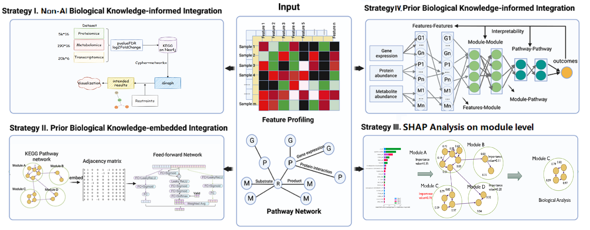
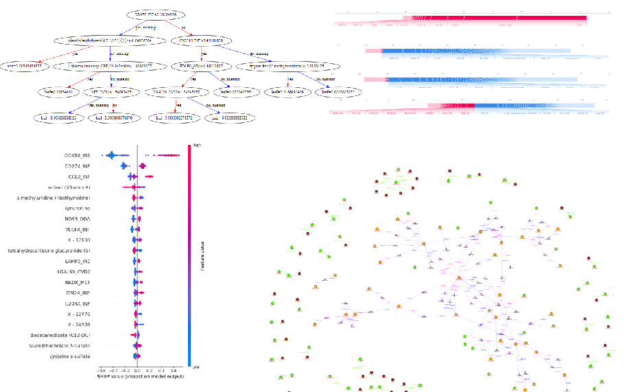

# Multiomics_code

This is a repository of the researches on multiomics mainly by **Liu Yifeng**(Lewis Yik-fung Lau) of *IIIS* , **Li Biao** of *Shanghai Qi Zhi Institute* as well as **Zhao Yizi** from *School of Pharmaceutical Sciences, Tsinghua University*, who are also instructed by **Prof. Hu Zeping** from *School of Pharmaceutical Sciences, Tsinghua University* and **Prof. Yuan Yang** from *IIIS*. Also thank **Prof. Sheng Wang** from University of Washington for help.

This research also contains the main part of the AI+X course of Liu Yifeng (Conductor: Fang Zhixuan from *IIIS*)

PDF is available at [Medical Multi-omics](https://github.com/lauyikfung/multiomics/blob/main/Medical_Multi_omics.pdf).

## 1. Database and Dataset

We are based on the **KEGG** database which contains 19418 compounds, 8005 enzymes, 50650 genes, 459 modules, 25252 orthologs, 690 pathways as well as 11776 reactions.

We have get in touch with multiple dataset, including covid-19 dataset, ZIKV dataset, lung cancer dataset as well as TNBC dataset.

### 1.1 Covid-19 Dataset

We have collect the covid-19 dataset from (*Su, Yapeng, et al. "Multiple early factors anticipate post-acute COVID-19 sequelae." *Cell* 185.5 (2022): 881-895.*) which contains a total of 493 samples of proteomics with 454 features, and 377 samples of metabolomics with 891 features. Among them, INCOV patients included samples at three time points, namely T1 (clinical diagnosis period), T2 (acute period) and T3 (2-3 months after the initial symptoms, recovery period). Specifically, the dataset includes: proteomic data of 289 Healthy and 204 INCOVs; The metabonomic data of 178 Healthy and 199 INCOV patients.

And we have also selected some important features of proteomics and metabolomics according to KEGG database.

### 1.2 ZIKV Dataset

The ZIKV dataset is from Hu-Lab of *School of Pharmaceutical Sciences, Tsinghua University*, and the users can also process the data using the same method of 3.1.1. using "functional.py"

**Both the Covid-19 and ZIKV Dataset are available on the neo4j database in the charge of Li Biao.**

### 1.3 Lung Cancer Dataset

We also collect the multiomics dataset of patients with lung cancer from *Shanghai Medical College of Fudan University* with over 25,000 features, about 60 samples and 7 classifications. But the dataset is not publicly available at the request of the copyright owner. Since the scarcity of samples, we have got little result based on the dataset.

### 1.4 TNBC Dataset (/TNBC_new)

We utilized the multiomics dataset of TNBC patients from *Xiao, Yi, et al. "Comprehensive metabolomics expands precision medicine for triple-negative breast cancer." *Cell research* 32.5 (2022): 477-490.*, which contains 258 samples and over 20k features. The samples are classified into 4 types: **LAR, IM, BLIS, MES**.

After filtering according to KEGG database, we have chosen about 1k features.

## 2. Methods



Our main idea is to deconstruct the classification model to get the parameter matrices and get some information according to the matrix and prior knowledge of biology, especially metabology.

The first method is using multi-layer feed-forward networks. Similar to *Nature, Biologically informed deep neural network for prostate cancer discovery,2020, Haitham A, E. et. al.*, we construct two such networks for both omics. While for the multi-omics, to include the interaction between two omics, we creatively combined two feed-forward networks with a third one with a residual connection in the first layer, which can reflect this kind of relationship to some degree. The final result is a weighted average of two separate network, and the third network calculated the weights by softmax. Since our dataset has many unmatched samples, we implemented it with an additional input of valid, indicating the availability of corresponding part of data.

Our classification model can reach an accuracy of near 75 percent on test dataset. And according to the analysis of the residual part, from the parameter matrix, we have found the obvious connection between IFNG and some other compounds, showing a potential research direction.

The second method is implemented with XGBoost with SHAP analysis on the same classification method, which has achieved an accuracy of near 78%. And from SHAP analysis, LIF protein and cysteine['sistin] sulfate are the most significant indicators of the healthy status of sample, while the DOX58 is the most important indicator of infection of COVID-19, which can be potential for the further medical analysis.

## 3. Files

We are based on the image database of KEGG on neo4j which is in the charge of Li Biao. You should first get access to Li Biao and then reproduce the result.



### 3.0 Preparation for running codes

You should first complete the "connect.sh" and "constant/db.py" for connecting to the neo4j database. And install modules in 3.3.5 section

### 3.1 Covid-19 Files

#### 3.1.1 Non-NN method

The “test_covid_free.py”, “test_covid_light.py” and “test_covid_tight.py” are 3 python files running the non-NN method on covid dataset with different filtering conditions. It would generate “.graphml” files which can be visualized by “draw.ipynb” file.

#### 3.1.2 NN-method

The “mydataset.py”, “classifier.py” as well as “train_covid.py” is the training part of covid-19 classification tasks. You can select the classifier in CLS\_TYPE = [ "protein", "metabolomics", "both", "with\_adj\_matrix", "pnet_improve"], and you just run:

```
python train_covid.py --type CLS_TYPE
```

See “classifier.py” for a detailed description of these 5 classifiers. See “train_covid.py” for the other parameters. But if you choose another dataset, remember to edit the “get_original_data()” and “train()” parts of the “train_covid.py”.

### 3.2 TNBC

The “process_TNBC.ipynb” is the interacting program file training and illustrating the visualized and analysis results using XGBoost and SHAP. And it can also generate files of “.graphml” which can be visualized by “draw.py”. Since the directly plotting is not satisfying, using jupyter kernel is a better choice and all the graphs can generated from the “.ipynb” program.

### 3.3 Miscellaneous

#### 3.3.1 functional.py

Some important functions including updating of database and process of non_TNBC data of ZIKV.

#### 3.3.2 Draw.ipynb

It is the visualization file that can visualize the “.graphml” files. Although the plotted graph can be directly saving as ".svg" file, but the shape is not so satisfying, so you run this file to get a more beautiful graph using jupyter and just download the graph with it.

Attention: you may need to update your jupyter version.

#### 3.3.3 Other important files

You should complete the "connect.sh" and "constant/db.py" for connecting to the neo4j database.

#### 3.3.4 Requirement Modules

```
neo4j
py2neo
pandas
networkx
matplotlib
igraph
pytorch
numpy
tqdm
```

## 4. Acknowledgement

Thanks to Li Biao for contribution of all the files in "database" folder and majority of files in "constants" folder.

Thanks to Prof. Yuan, Prof. Hu, Li Biao, Zhao Yizi for advising.

Thanks to Prof. Sheng Wang for help.
